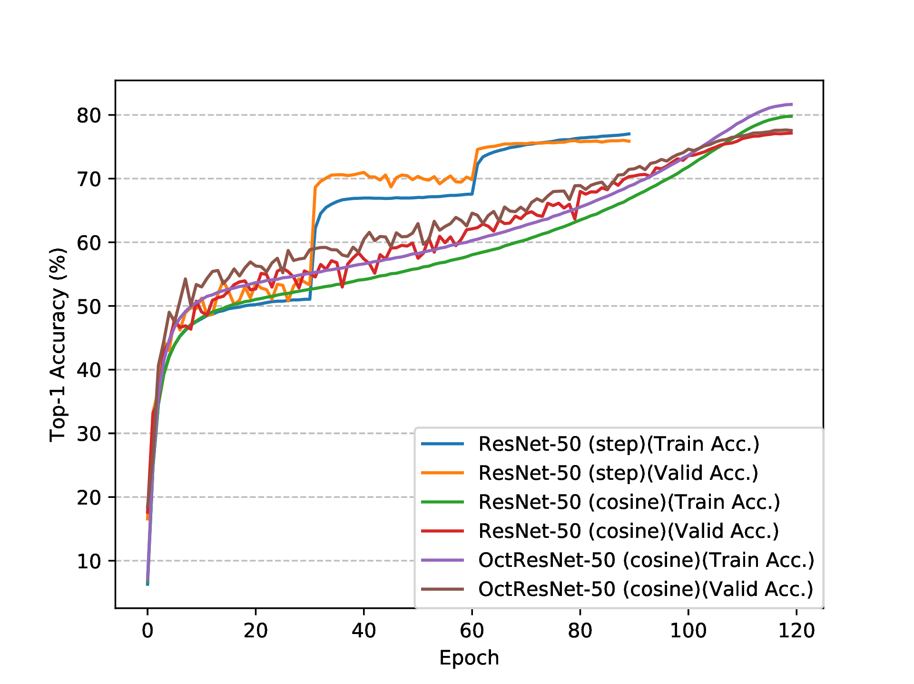

# octconv.pytorch
[PyTorch](pytorch.org) implementation of Octave Convolution in [Drop an Octave: Reducing Spatial Redundancy in Convolutional Neural Networks with Octave Convolution](https://arxiv.org/abs/1904.05049)

## ResNet-50/101 on ImageNet
| Architecture             | LR decay strategy   | Parameters | GFLOPs | Top-1 / Top-5 Accuracy (%) |
| ------------------------ | ------------------- | ---------- | ------ | ----------------------- |
| [ResNet-50](https://drive.google.com/open?id=1n7H6WNrvtf0eyWeWotbWD1kb95iVWaze)                | step (90 epochs)    | 25.557M    | 4.089  | 76.010 / 92.834         |
| [ResNet-50](https://drive.google.com/open?id=1_aconGn2oZB1Bvgq65g2tsqSI7CSPAEt)                | cosine (120 epochs) | 25.557M    | 4.089  | 77.150 / 93.468         |
| [Oct-ResNet-50 (alpha=0.5)](https://drive.google.com/open?id=1F9esqmbIJmfTOsAZ6_6JEUnI83LVgF_S) | cosine (120 epochs) | 25.557M    | 2.367  | 77.640 / 93.662         |
| [ResNet-101](https://drive.google.com/file/d/128pkjPIN8hvjmbsSmUb62cikmiPjlgb1/view?usp=sharing) | cosine (120 epochs) | 44.549M | 7.801 | 78.898 / 94.304 |
| [Oct-ResNet-101 (alpha=0.5)](https://drive.google.com/file/d/1E3To8EZDlVX8EfIU4q4r6SHDUHStKOqG/view?usp=sharing) | cosine (120 epochs) | 44.549M | 3.991 | 78.794 / 94.330 |


<p align="center"></p>


## MobileNet V1 on ImageNet
| Architecture             | LR decay strategy   | Parameters | FLOPs | Top-1 / Top-5 Accuracy (%) |
| ------------------------ | ------------------- | ---------- | ------ | ----------------------- |
| [MobileNetV1](https://drive.google.com/file/d/14FBekvITT77z2LX_2utFGMteK3gxN1vn/view?usp=sharing) | cosine (150 epochs) | 4.232M | 568.7M | 72.238 / 90.536 |
| [Oct-MobileNetV1](https://drive.google.com/file/d/1hpXYlHuTLeg04BOTFInrDYsaM4P-b0vK/view?usp=sharing) | cosine (150 epochs) | 4.232M | 318.2M | 71.254 / 89.728 |

## Acknowledgement
[Official MXNet implmentation](https://github.com/facebookresearch/OctConv) by [@cypw](https://github.com/cypw)

## Citation
```bibtex
@InProceedings{Chen_2019_ICCV,
author = {Chen, Yunpeng and Fan, Haoqi and Xu, Bing and Yan, Zhicheng and Kalantidis, Yannis and Rohrbach, Marcus and Yan, Shuicheng and Feng, Jiashi},
title = {Drop an Octave: Reducing Spatial Redundancy in Convolutional Neural Networks With Octave Convolution},
booktitle = {The IEEE International Conference on Computer Vision (ICCV)},
month = {October},
year = {2019}
}
```
